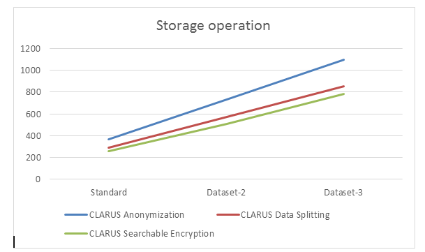
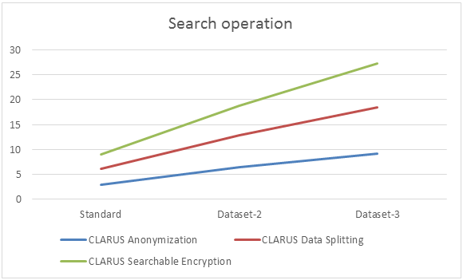

#	Evaluation Scenarios
Three scenarios have been defined in order to support the validation of CLARUS. The datasets used in the test scenarios are described in the data management plan (D1.2). The recommendations made by the WP5 related to the construction of the datasets states that these need to be constructed using a transactional method if we deal with the PostgreSQL protocol module (which is the case for our tests). Each action needs to be surrounded by the keywords “BEGIN” and “COMMIT”.

##	Security-less
This scenario allows us to gather baseline metrics and behavior in order to compare them with the behavior of the CLARUS proxy. We emulate a real-life behavior with a PostgresSQL  server as endpoint to emulate a real-life use case.
The hardware that is used for this scenario is two Intel NUC  with a quad core CPU and sixteen Gigabyte of memory. The network link between the two will be a Netgear GS108 switch . The operating system is an Ubuntu server 16.04.01 LTS. One of the two NUC is the client side with the tests injector and the other NUC is the PostgresSQL server (PostgreSQL 9.5)

##	Local Security
The local security scenario portraits a naïve mechanism to achieve security against an honest-but-curious adversary, the CSP, which is to encrypt all data before outsourcing it to the cloud. While this method offers a very high security level (even hides access patterns to particular piece of data), it does not allow any operation on the data, as all operations require the user to download the whole dataset, decrypt it and operate on it, sometimes having to re-encrypt and re-upload. 
We emulate an application behavior with a PostgresSQL server as endpoint to emulate a real-life use case. Before any computation or upload an encryption of the dataset’s fields is done using a AES  Cipher with a 128 bytes key and Cipher Block Chaining.
The hardware that is used for this scenario is two Intel NUC with a quad core CPU and sixteen Gigabyte of memory. The network link between the two is a Netgear GS108 switch. The operating system is an Ubuntu server 16.04.01 LTS. One of the two NUC is the client side with the tests injector and the other NUC is the PostgresSQL server (PostgreSQL 9.5).

##	CLARUS
This scenario is identical to the first one with the exception of another quad core Intel NUC with sixteen Gigabyte of memory deployed as a proxy between the injector and the PostgresSQL server. On this server is installed the CLARUS proxy. The PostgreSQL server represents the instance running on the cloud. The CLARUS proxy is intended to be running within the premises of the company (i.e. in the datacenter).
Allowed operations on the dataset depend on the particular security mechanism used to protect it, as described in D3.2 and below in this document.

# Evaluation Results
##	Performance
###	REQ-NF_PERF-1.1
Description: The protection mechanisms introduced and embodied by CLARUS must not significantly degrade the response time compared to the normal behaviour of data processing
**Validation**: *Test*
This requirement describes the response time and the degradation that is induced by the use of an additional component such as CLARUS. To measure this degradation in terms of user experience we need to extract the whole time taken by a standard application use.
The three scenarios described in section 2.4 (the Security-less, local security and CLARUS) will be used to validate this requirement and allow us to extract the “time to compute” overhead. The use case will be initialization of the ehealth database using the simple encryption module (i.e. local security), and CLARUS supporting different data protection mechanisms: Anonymization, data splitting and searchable encryption . We perform the test for 3 different actions Storage, Retrieve and Search.
To run this scenario, we will use the following scripts:
* Launcher.py

#### Usage

```bash
rferrari@NUC1261$ ./launcher postgres clarus dataSets/ehealth/ REQ-NF_PERF-1.1
````

#### Results
The results are reported in this table. The values are in seconds. Notice that we performed each test 5 times and we stopped the test if the value is more than 1 day.

**Storage**

| Scenario |Standard |Large|Xlarge|
|--|--|--|-- |
| Security Less |18  |88  |1 730|
| Local Security | 215 |18 861 |> 1day|
| CLARUS Anonymization |367 |21 088 |> 1day|
| CLARUS Data Splitting |287|19 678|> 1day|
| CLARUS Searchable encryption |256  | 19 257 |> 1day|

**Retrieve**

| Scenario |Standard |Large|Xlarge|
|--|--|--|-- |
| Security Less |20,0|92,0 |2 100,0|
| Local Security | 229,0|18 861,0|> 1day|
| CLARUS Anonymization |387,0|22 865,0|> 1day|
| CLARUS Data Splitting |298,0|24 699,0 |> 1day|
| CLARUS Searchable encryption |265,0|19 346,0|> 1day|

**Search**

| Scenario |Standard |Large|Xlarge|
|--|--|--|-- |
| Security Less |2,0|18,0|137,0  |
| Local Security | 218,1|19 276,0|>1day|
| CLARUS Anonymization |3,0|17,0|235,0|
| CLARUS Data Splitting |3,1|19,0|267,0|
| CLARUS Searchable encryption |2,9|27,0|285,0|

The overhead of using CLARUS data protection mechanism is very high for storage and is acceptable for other actions. Notice that if we compare the search functionality with simple encryption, we perform better since simple encryption needs to retrieve all the data locally before decrypting it and performing search. We can consider that the requirement is partially fulfilled.

### REQ-NF_PERF-1.2
Description: CLARUS should improve the performance of requests (e.g. search, operations) compared to naïve implementations of security-enabling solutions already available in some commercial products.
**Validation**: *Test*
This requirement describes the improvements made by CLARUS compared to existing security solutions. We need to monitor the improvement for a specific request in terms of overall time but also hardware requirements needed to use an end-user application. To evaluate the evolution of the complexity we also need to use multiple datasets with different size in order to validate that the complexity of the computation is linear.
Two scenarios are compared: CLARUS proxy (with 3 different data protection modules) and the “naïve” implementation of the security technique (simple encryption) that needs to retrieve the whole data, decrypt it before performing any search. 
We also report the following metrics:
* Response time
* CPU Usage
* Memory Usage
* Bandwidth usage
* IO usage

To run this scenario, we will use the following scripts:
* Launcher.py
* Probe.sh
* killProbe.sh

#### Usage
```bash
rferrari@NUC1261:~/git/CLARUS/benchmarks/scripts$ sudo ./performance/probe.sh;./launcher postgres clarus dataSets/ehealth/ REQ-NF_PERF-1.2; sudo pkill probe.sh
````

#### Results
The results are reported in this table. The values are in seconds. Notice that this search takes more time if we compared it with security-less scenario, but it highly improves the “naïve” scenario implementing simple encryption.

**Search**


| Scenario  | Standard | Large | Xlarge |
|--|--|--|--|
|Security-Less|2,0 |18,0|137,0|
|Local Security|218,1|19 276,0|>1day|
|CLARUS Anonymization|3,0|17,0|235,0|
|CLARUS Data Splitting|3,1|19,0|267,0|
|CLARUS Searchable Encryption|2,9|27,0|285,0|


### REQ-NF_PERF-1.3
Description: CLARUS should improve the performance of requests (e.g. search, operations) compared to the same approach directly on the end user’s computer.
**Validation**: *Test*
CLARUS should improve the performance of requests (e.g. search, operations) compared to the same approach directly on the end user’s computer.
This requirement describes the improvements made by CLARUS compared to the same approach with naïve security implementation. We monitor the improvement for a specific request in terms of overall CPU and memory usage needed to use an end-user application. To evaluate the evolution of the complexity we also need to use multiple datasets in order to validate that the complexity of the computation is linear.
This test has been performed for search operation for the 3 types of datasets.

####	Usage
```bash
rferrari@NUC1261:~/git/CLARUS/benchmarks/scripts$ sudo ./performance/probe.sh; sudo ./launcher postgres clarus dataSets/ehealth/ REQ-NF_PERF-1.3; sudo ./performance/killProbe.sh;
````

#### Results
This test shows that the CPU/RAM usage in the local approach is smaller than the using CLARUS because the CLARUS leverages the CPU and RAM of the CSP. Indeed, this is one of the advantages of the CLARUS approach that allows to benefit from the computation of CSP in order to consume less resources in the local devices. CPU, memory, IO and bandwidth usage are reported in the following graphs.

### REQ-NF_PERF-1.4
Description: Performance should be linear with respect to the size of the datasets
**Validation**: *Test*
In order to validate this requirement we will need to use different sized dataset provided for the CLARUS use case and run them through our CLARUS toolbox. We will analyze the overall time taken by CLARUS to process the different datasets. For this requirement we are specifically interested in the evolution of the time to compute.
We performed the test for 3 different data protections: Anonymization, splitting and searchable encryption. The operations taken into account were: storage, retrieval and search.

####	Usage
```bash
./launcher postgres clarus dataSets/ehealth/ REQ-NF_PERF-1.4
````

####	Validation
If the processing time is linear compared to the size of the dataset this requirement will be validated.

#### Result
It was not possible to check the linearity for the storage and retrieval actions since the Xlarge dataset needs more than one day to be uploaded or retrieved. That’s why we, performed the tests with 3 new data sets that are the standard dataset, dataset-2 that is that has the double size of the standard dataset and dataset-3 that has 3 times the size of standard dataset. The results of provided in the following table.

**Storage**

| Scenario |Standard |Dataset-2|Dataset-3|
|--|--|--|-- |
| Security Less |18  |36  |55|
| Local Security | 215 |430 |630|
| CLARUS Anonymization |367 |730 |1095|
| CLARUS Data Splitting |287|570|852|
| CLARUS Searchable encryption |256  | 509 |780|

**Retrieve**

| Scenario |Standard |Dataset-2|Dataset-3|
|--|--|--|-- |
| Security Less |20,0|92,0 |2 100,0|
| Local Security | 229,0|N/A|N/A|
| CLARUS Anonymization |387,0|N/A|N/A|
| CLARUS Data Splitting |298,0|N/A|N/A|
| CLARUS Searchable encryption |265,0|N/A|N/A|

**Search**

| Scenario |Standard |Dataset-2|Dataset-3|
|--|--|--|-- |
| Security Less |2,0|18,0|137,0  |
| Local Security | 218,1|19 276,0|>1day|
| CLARUS Anonymization |3,0|6,4|9,1|
| CLARUS Data Splitting |3,1|6,4|9,3|
| CLARUS Searchable encryption |2,9|6,0|8,9|






As a conclusion to this graph we can state that the evolution of the global time to compute is linear compared to the size of the dataset when using CLARUS. Which is the result expected.

# Lesson learned

The main conclusion related to the evaluation of the CLARUS proxy demonstrated the complexity of such software that is intended to cover different protocols modules, data protection mechanisms and different types of data. This engendered multiple technical issues in the development part and caused some performance issues in the proxy itself.
The tests conducted in this work package were tremendously helpful to provide a global overview on CLARUS’ global performance. It allowed us to tune some of the implementation during the actual development.
* **Automation of evaluation**: The performance benchmarks were conducted by using real world scenarios inspired by use cases provided by AKKA System and FCRB. We mainly chose to focus on the e-health use case; the reason is that it was the scenario that was able to handle a lot of automatization. Automation was, in fact, the most critical part of our work in this deliverable. We wanted to be able to reproduce on demand almost each test automatically. As an example, before a release (pre-release state of CLARUS) or even during the development cycle, a simple push of a button will be needed to launch the whole testing plan and provide to the integration and development team a report describing the impact made by the new features or fix on the code in terms of performance and regression.
*	**Development**: The CLARUS proxy is provided as an open source project available in Github. The project is well documented, and a user guide is provided to ensure an easy deployment and configuration of the proxy
*	**Development**: The CLARUS proxy can be easily extended to add more data protection modules. A documented API is provided and well document to perform this task.
*	**Development**: The CLARUS proxy can also be extended to manage more protocols. The protocol API is also provided and well documented. The addition of a new protocol is a tough task and requires a lot of expertise in networking. Besides, the size of such module is in general several hundreds of lines of code to be able to manage different data types and different transmission modes (buffering, real-time etc.). 
*	**Proxy security**: The proxy is complemented by a monitoring solution based on MMT tool that allows to detect several kinds of attack and apply corrective actions to ensure the confidentiality and integrity of sensitive data. 
*	**Performance**: Performance at the storage stage is significantly degraded but this is not the case for daily queries. So, users may delay or batch initial storage. Nevertheless, the code needs more non-functional development work in order to be able to unlock its true potential. This endeavour is more oriented toward industrial development to be able to industrialize the tool.
*	**Performance**: The proxy improves performance with respect to the “naïve” protection solution based on simple encryption where data need to be totally retrieved before applying any computation e.g., search. 
*	**Performance**: The latency added by the proxy is not very significant for data protection mechanisms in which the protection operations can be done on the fly (called streaming mode). This is the case, for example, of data splitting or simple encryption. The latency is more significant, and can be noticed by the end user, when a buffering of data is necessary. For instance, the anonymization protection mechanism. 
*	**Performance**: This test shows that the CPU/RAM usage in the local approach is smaller than using CLARUS because the CLARUS leverages the CPU and RAM of the CSP. Indeed, this is one of the advantages of the CLARUS approach that allows to benefit from the computation of CSP in order to consume less resources in the local devices.
*	**Scalability**: The proxy performs different tasks (storage, retrieval, search) in a linear way according to the size of datasets. This allow us to apply different parallelization mechanisms (multi-core solution, load balancing) to guarantee scalability.
*	**Scalability**: Regarding the scalability testing, we can say that CLARUS is a robust solution capable of seamless integration inside an already existing infrastructure. It is a scalable solution and can use existing solutions offered by CSPs such as services clustering. The promises made by the component are in place and the security features are fully functional.
*	**Standardization**: The CLARUS proxy supports most of the standards used in the different business domains on which CLARUS is deployed.
*	**Legal and ethical requirements**: The CLARUS proxy respects all the legal and ethical requirements.

## Data anonymization via Coarsening

|  |  |
|--|--|
| Efficiently supported operations* | 	Storage – Update – Search – Any computation |
|Performance impact on local premises |Constant |
|Data accuracy preservation	 |Approximate results |
|Access of non-CLARUS users	 | Yes|
|Security Privacy| Medium|
|Management|Transparent|

## Data anonymization via Microaggregation

|  |  |
|--|--|
| Efficiently supported operations* | 	Storage – Search – Any computation |
| Performance impact on local premises | Quasi-linear for storage phase |
| Data accuracy preservation | Approximate results |
| Access of non-CLARUS users | Yes |
| Security Privacy| High  |	
|Management |	Transparent |

## Data Splitting

**Data splitting** makes a local partition of the sensitive data and separately stores data fragments in different CSPs, in a way that each individual fragment does not cause privacy risks; data fragments are stored in the clear without any modification; hence, the data accuracy and the analytical interest are efficiently preserved. Since data are split and only CLARUS knows the exact cloud locations for a given dataset, CLARUS performs an adaptation (and/or orchestration) of user queries and an aggregation of the results.

|||
|--|--|
|Efficiently supported operations*|Storage – Update – Search – Any computation|
|Performance impact on local premises|Constant|
|Data accuracy preservation	|Full accuracy|
|Access of non-CLARUS users|No. Only to partial data|
|Security – Privacy|Medium. High if we ensure CSPs do not collude.|
|Management|Some operations require dedicated modules in the CSP|

## Data Encryption

**Data encryption** is a method to protect data in a secure and reversible way. The scheme requires a secret key that is used both to encrypt and to decrypt data: it is a symmetric-key encryption scheme. The security of the scheme is based on the hardness of the best algorithm known to recover the original data, in the case a user does not have the secret key. The encrypted data can only be accessed by the users owning the key. Encryption is performed by CLARUS once at the storage stage, and the decryption is performed after recovering the encrypted data from the CSP. The keys are stored at the proxy. In this way, the CSP never has access to the plaintext data or to the keys. 

|||
|--|--|
|Efficiently supported operations*|Storage|
|Performance impact on local premises|Linear|
|Data accuracy preservation| Full Accuracy|
|Access of non-CLARUS users|No|
|Security – Privacy|Very high|
|Management	|Key management|

## Homomorphic Encryption

**Homomorphic encryption** is used to store data in a secure way that allows performing certain computations directly on the encrypted data. The encryption is reversible. The security of the scheme is based on the hardness of the mathematical problem that is needed to recover the original data. The encryption scheme is a public-key one, and the secret key is stored in CLARUS. The secret key is used to decrypt data. The encrypted data can only be decrypted by the users owning the secret key. Encryption is performed by CLARUS once at the storage stage, and the decryption is performed after recovering the encrypted data from the CSP. Before recovering the data, it is possible to perform sums on the encrypted data. In this way, the user can recover a value that is the output of a linear function.

|||
|--|--|
|Efficiently supported operations*|Storage – Some predefined operations|
|Performance impact on local premises|Linear|
|Data accuracy preservation|Full|
|Access of non-CLARUS users|No|
|Security – Privacy|Very High|
|Management|Operations require dedicated modules in the CSP|

## Searchable Encryption

**Searchable encryption** is used to store data in a secure way that allows performing queries on the encrypted data. The encryption is reversible. The security of the scheme is based on the hardness of the mathematical problem that is needed to recover the original data. The scheme is a symmetric encryption scheme and requires a secure key that is used both to encrypt and decrypt data. The encrypted data can only be accessed by the users owning the key. Encryption is performed by CLARUS once at the storage stage, and the decryption is performed after recovering the encrypted data from the CSP. The user can perform queries on the encrypted data. The answer of the query is a link to the encrypted document containing the keywords in the query.

|||
|--|--|
|Efficiently supported operations*	|Storage – Some predefined searches|
|Performance impact on local premises|Linear|
|Data accuracy preservation	|Full|
|Access of non-CLARUS users	|No|
|Security – Privacy|Very High|
|Management|Searches require specific modules in the CSP.|
	
A more global conclusion will be that CLARUS fulfilled the majority of its requirements and mainly its functional promise related to privacy. 
